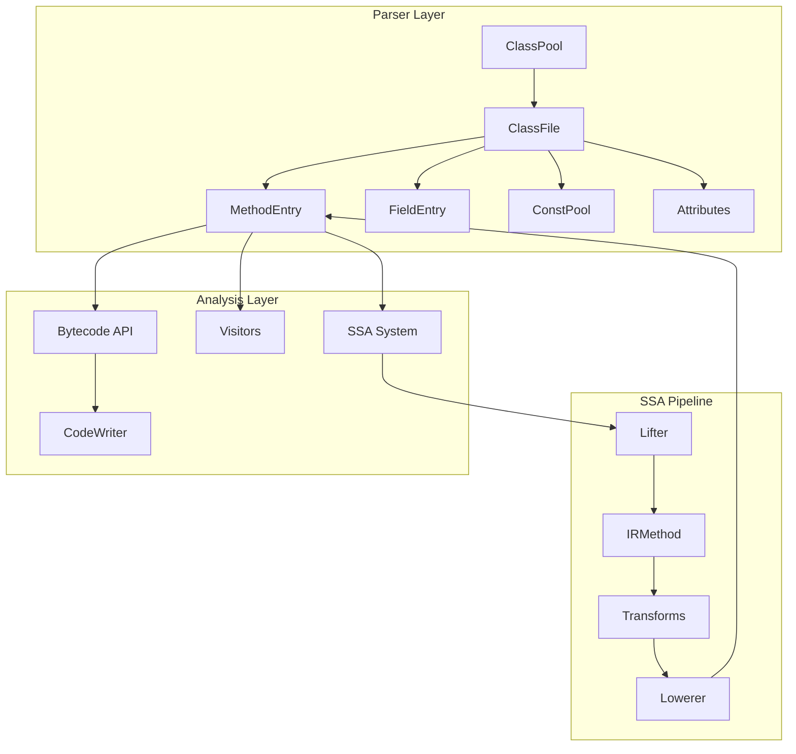
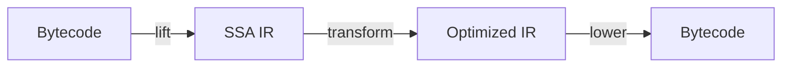

[<- Back to README](../README.md) | [Quick Start](quick-start.md) | [Class Files ->](class-files.md)

# Architecture Overview

YABR (Yet Another Bytecode Reader/Writer) is a Java bytecode manipulation library organized into two main subsystems: **parsing** and **analysis**.

## System Architecture



## Package Structure

| Package | Purpose |
|---------|---------|
| `com.tonic.parser` | Class file parsing and representation |
| `com.tonic.parser.constpool` | Constant pool items and management |
| `com.tonic.parser.attribute` | Class file attributes (Code, StackMapTable, etc.) |
| `com.tonic.analysis` | Bytecode manipulation (Bytecode, CodeWriter) |
| `com.tonic.analysis.instruction` | Individual bytecode instructions |
| `com.tonic.analysis.visitor` | Visitor patterns for traversal |
| `com.tonic.analysis.ssa` | SSA IR system |
| `com.tonic.analysis.ssa.ir` | IR instruction types |
| `com.tonic.analysis.ssa.cfg` | Control flow graph (IRMethod, IRBlock) |
| `com.tonic.analysis.ssa.lift` | Bytecode to SSA lifting |
| `com.tonic.analysis.ssa.lower` | SSA to bytecode lowering |
| `com.tonic.analysis.ssa.transform` | IR optimizations |
| `com.tonic.analysis.ssa.analysis` | Analysis passes (dominators, liveness) |
| `com.tonic.analysis.frame` | StackMapTable frame computation |
| `com.tonic.utill` | Utilities (AccessBuilder, Logger, etc.) |
| `com.tonic.demo` | Example programs |

## Core Components

### Parser Layer

**ClassPool** - Container for loaded classes. Automatically loads `java.base` classes on initialization.

```java
ClassPool pool = ClassPool.getDefault();
ClassFile cf = pool.get("java/lang/String");
```

**ClassFile** - Represents a complete `.class` file with fields, methods, and attributes.

**ConstPool** - Manages the constant pool entries (strings, class refs, method refs, etc.).

**MethodEntry / FieldEntry** - Individual method and field definitions.

### Analysis Layer

**Bytecode** - High-level API for adding common bytecode instructions:
```java
Bytecode bc = new Bytecode(method);
bc.addGetStatic("java/lang/System", "out", "Ljava/io/PrintStream;");
bc.addLdc("Hello");
bc.addInvokeVirtual("java/io/PrintStream", "println", "(Ljava/lang/String;)V");
bc.finalizeBytecode();
```

**CodeWriter** - Low-level bytecode manipulation with direct instruction access.

**Visitors** - Three visitor patterns for different analysis levels:
- `AbstractClassVisitor` - Class-level (fields, methods, attributes)
- `AbstractBytecodeVisitor` - Instruction-level bytecode
- `AbstractBlockVisitor` - SSA IR block-level

### SSA System

**SSA** - Main entry point for SSA operations:



The SSA pipeline:
1. **Lift** - Convert stack-based bytecode to register-based IR
2. **Transform** - Apply optimizations (constant folding, copy propagation, DCE)
3. **Lower** - Convert IR back to bytecode

**IRMethod** - SSA-form method containing IRBlocks

**IRBlock** - Basic block with phi instructions and regular instructions

**IRInstruction** - 29 instruction types representing all JVM operations

## Data Flow

### Loading and Parsing

```
.class file bytes
    |
    v
ClassFile(bytes) - verifies magic number (0xCAFEBABE)
    |
    v
ConstPool - parses constant pool entries
    |
    v
Fields, Methods, Attributes - parsed with CP references
    |
    v
ClassFile ready for manipulation
```

### Bytecode Modification

```
MethodEntry
    |
    v
CodeWriter - wraps CodeAttribute
    |
    v
Insert/append instructions
    |
    v
write() - updates CodeAttribute bytes
    |
    v
ClassFile.write() - produces modified .class
```

### SSA Transformation

```
MethodEntry
    |
    v
BytecodeLifter.lift() - creates CFG, translates instructions
    |
    v
PhiInserter.insertPhis() - adds phi nodes at join points
    |
    v
VariableRenamer.rename() - converts to SSA form
    |
    v
IRTransforms - optimizations
    |
    v
BytecodeLowerer.lower() - back to bytecode
```

## Key Design Decisions

1. **Lazy Loading** - ClassPool loads built-in classes on demand from JRT (Java 9+) or rt.jar (Java 8)

2. **Mutable Model** - ClassFile and its components are mutable for easy manipulation

3. **Visitor Pattern** - Multiple visitor types allow analysis at different granularities

4. **SSA for Optimization** - SSA form simplifies dataflow analysis and enables powerful optimizations

5. **Frame Computation** - Automatic StackMapTable generation for Java 7+ verification

## Related Documentation

- [Working with Class Files](class-files.md) - ClassPool, ClassFile, ConstPool details
- [Bytecode API](bytecode-api.md) - Bytecode and CodeWriter usage
- [Visitors](visitors.md) - Traversal and transformation patterns
- [SSA Guide](ssa-guide.md) - SSA IR system in depth
- [Frame Computation](frame-computation.md) - StackMapTable generation

---

[<- Back to README](../README.md) | [Quick Start](quick-start.md) | [Class Files ->](class-files.md)
